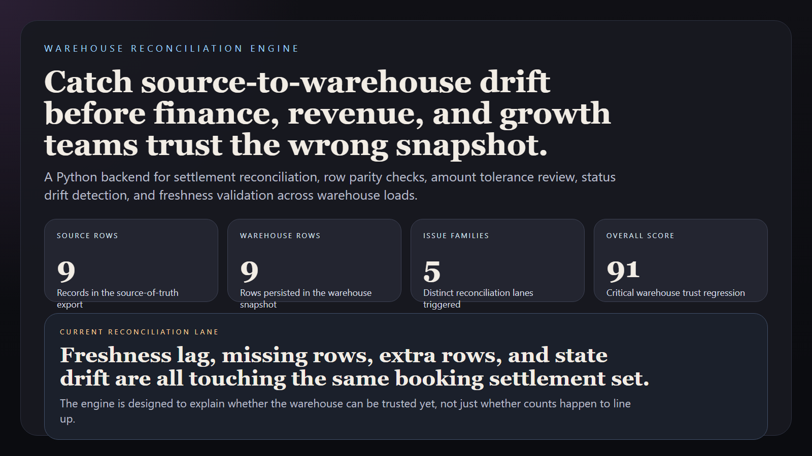
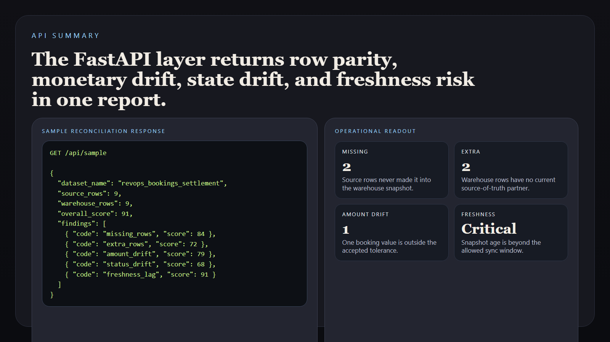
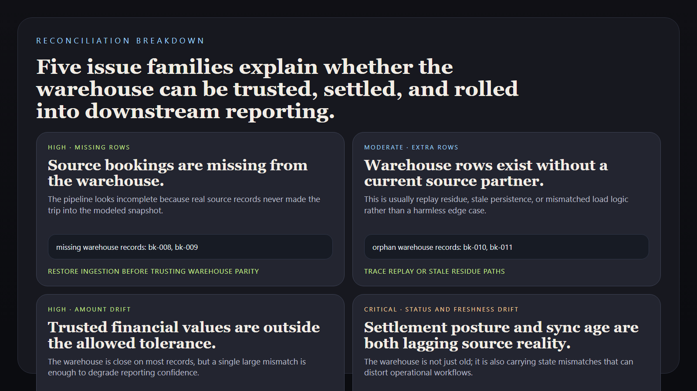
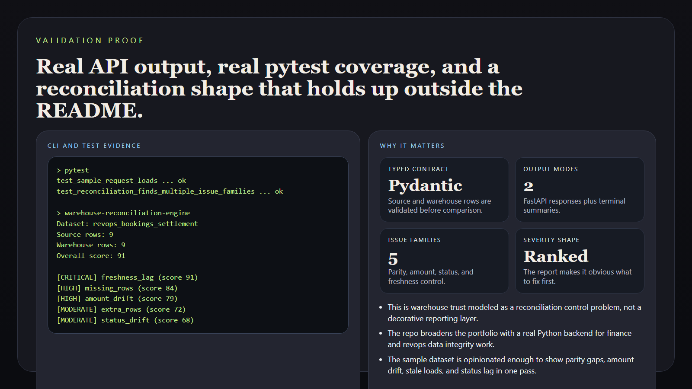

# Warehouse Reconciliation Engine

> **Python reconciliation portfolio project** for source-to-warehouse drift detection, row settlement review, metric deltas, and operational warehouse trust controls.

**Portfolio takeaway:** *"Warehouse confidence rises when source drift, settlement gaps, and metric mismatches are ranked before they leak into reporting."*

---

## Project Overview

| Attribute | Detail |
|---|---|
| **Language** | Python |
| **Runtime Shape** | FastAPI + CLI |
| **Domain** | Warehouse reconciliation and trust verification |
| **Reconciliation Families** | missing rows · extra rows · amount drift · state drift · freshness lag |
| **Output Modes** | JSON API · terminal summary |
| **Primary Users** | analytics engineering · revenue operations · finance systems |

---

## Executive Summary

Warehouse Reconciliation Engine models the sort of backend teams use when the warehouse cannot simply be assumed correct. Instead of leaving reconciliation as an ad hoc spreadsheet task, the service loads source records and warehouse records into typed contracts, compares row presence and trusted fields, scores the resulting mismatches, and returns an operational report with evidence and next actions.

The repo is intentionally built as a Python service instead of a frontend dashboard. It demonstrates how warehouse confidence can be treated as a backend control problem: reconcile the source of truth, isolate drift, rank the damage, and route the next action before executive reporting, forecasting, or attribution layers start trusting bad numbers.

---

## Reconciliation Flow

```text
source snapshot + warehouse snapshot
              |
              v
typed reconciliation request
              |
              +--> missing row checks
              +--> extra row checks
              +--> amount drift checks
              +--> status drift checks
              +--> freshness lag checks
              |
              v
severity-scored reconciliation report
```

---

## Reconciliation Families

### Missing Rows

- source records not present in the warehouse
- ingestion loss on important finance or revenue surfaces

### Extra Rows

- warehouse records with no source match
- replay or stale residue in downstream models

### Amount Drift

- mismatched revenue or contract values
- executive totals that no longer match source-of-truth records

### Status Drift

- state transitions that lag between source and warehouse
- lifecycle, deal, or settlement posture mismatch

### Freshness Lag

- delayed warehouse load beyond the accepted sync window
- stale analytics disguised as current state

---

## Usage

### Create a Virtual Environment

```bash
python -m venv .venv
.venv\Scripts\activate
pip install -e .[dev]
```

### Run the API

```bash
uvicorn app.main:app --reload
```

### Open the Docs

```text
http://127.0.0.1:8000/docs
```

### Run the CLI Summary

```bash
warehouse-reconciliation-engine
```

### Run the Tests

```bash
pytest
```

---

## Sample Output

```text
Warehouse Reconciliation Engine
===============================
Dataset: revops_bookings_settlement
Source rows: 9
Warehouse rows: 9
Overall score: 91

[CRITICAL] freshness_lag (score 91)
Summary: Warehouse load freshness is outside the allowed sync window.
```

---

## Screenshots

### Hero Capture



### API Summary



### Reconciliation Breakdown



### Proof Layer



---

## Industry Applications

### Revenue Operations

- catch booking rows that vanish between CRM/export and warehouse settlement
- surface amount drift before forecast and attainment dashboards diverge

### Finance Systems

- isolate extra or replayed warehouse rows before recognized revenue is trusted
- compare status and settlement posture between source ledgers and modeled marts

### Growth Analytics

- keep attribution and pipeline layers from trusting stale warehouse snapshots
- expose sync lag before downstream experimentation analysis starts drifting

---

## What This Demonstrates

- Python added meaningfully through a real reconciliation service
- Pydantic contracts and FastAPI used for warehouse trust workflows
- reconciliation modeled as a severity-ranked control problem
- CLI and API outputs shaped for actual operators
- evidence-backed reporting instead of generic “numbers don’t match” alerts

---

## Future Enhancements

- support file upload and object-store snapshot ingestion
- add tolerance profiles for currency, quantity, and seat-based products
- emit warehouse drift briefings for finance and revops review
- compare multiple warehouse runs for persistence and regression trend analysis
- add webhook escalation payloads for orchestration systems

---

## Tech Stack

[](https://www.python.org/)
[](https://fastapi.tiangolo.com/)
[](https://docs.pydantic.dev/)
[](https://docs.pytest.org/)

### Portfolio Links

- [LinkedIn](https://www.linkedin.com/in/mirzacausevic)
- [Kinetic Gain](https://kineticgain.com/)
- [Skills Page](https://mizcausevic.com/skills/)
- [GitHub](https://github.com/mizcausevic-dev)

---

*Part of [mizcausevic-dev's GitHub portfolio](https://github.com/mizcausevic-dev), with a focus on backend systems, revenue operations, data reliability, and operational decision tooling.*
